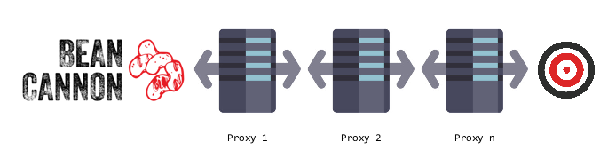

<p align="center">
    
</p>

<p>&nbsp;</p>

> ### Bean Cannon
> aka "Planetarium Destruction with an Improvised Bean Cannon".
> 

|Master|Development|
|:-----|:----------|
|[](https://github.com/kmataru/bean-cannon/tree/master)|[](https://github.com/kmataru/bean-cannon/tree/develop)|

##### Welcome to Bean Cannon's homepage!

## Table of Contents
- [About](#about)
- [Disclaimer](#disclaimer)
- [Goals](#goals)
- [Features](#features)
  - [Features coverage](#features-coverage)
- [Installation instructions](#installation-instructions)
- [Directory Contents](#directory-contents)
- [Thanks](#thanks)
- [Other similar projects/tools](#other-similar-projectstools)

## About

Bean Cannon - An open source network stress tool, written in C#.
Is an astral projection of NewEraCracker's project at [LOIC](https://github.com/NewEraCracker/LOIC)
based on Praetox's LOIC project at [loic](https://sourceforge.net/projects/loic/).
Influenced by [hulk.py](https://github.com/Saurav07/hulk.py) and designed with [MaterialSkin](https://github.com/IgnaceMaes/MaterialSkin).

## Disclaimer

This tool is released for educational purposes only, with the intent of helping server owners develop a "Hacker Defense" attitude. This tool comes without any warranty at all.

**You may not use this software for any illegal or unethical purpose; including activities which would give rise to criminal or civil liability.**

**Under no event shall the Licensor be responsible for the activities, or any misdeeds, conducted by the Licensee.**

## Goals

* Easy to use
* Clean and well structured source code

## Features

* Attractive UI
* Tiny CPU and RAM usage
* Easy configurable

### Features coverage

|                    |HTTP                |TCP                 |UDP                 |ReCoil              |SlowLOIC            |ICMP                |
|:-------------------|:-------------------|:-------------------|:-------------------|:-------------------|:-------------------|:-------------------|
|Random Proxy        |Yes                 |Yes                 |<span style="color:#C56D21">TBD<span>|<span style="color:#B72637">Needs more tests<span>|Yes                 |<span style="color:#C56D21">TBD<span>|
|Chained Proxy       |Yes                 |Yes                 |<span style="color:#C56D21">TBD<span>|<span style="color:#B72637">Needs more tests<span>|Yes                 |<span style="color:#C56D21">TBD<span>|
|Random user agent   |Yes                 |-                   |-                   |Yes                 |-                   |-                   |
|Random referrer     |Yes                 |-                   |-                   |Yes                 |-                   |-                   |

#### Chained proxy

<p align="center">
    
</p>

## Directory Contents

```
├── Modded                                             # Modded sub-modules.
└── src                                                # Source files.
    ├── BeanCannon.BusinessLogic.Core                  # Business logic VS project.
    └── BeanCannon.Presentation.MaterializedDesktopUI  # GUI VS project.
```

## Thanks
The following libraries / open-source projects were used in the development of Kartwars Bot:
* [LOIC](https://github.com/NewEraCracker/LOIC)
* [hulk.py](https://github.com/Saurav07/hulk.py)
* [MaterialSkin](https://github.com/IgnaceMaes/MaterialSkin)
* [SuperXml](https://github.com/beto-rodriguez/SuperXml)
* [Logo maker](https://www.tailorbrands.com/logo-maker)

### Other similar projects/tools:

* [LOIC](https://github.com/NewEraCracker/LOIC)
* [Slowdroid for Android](https://en.wikipedia.org/wiki/Slowdroid)
